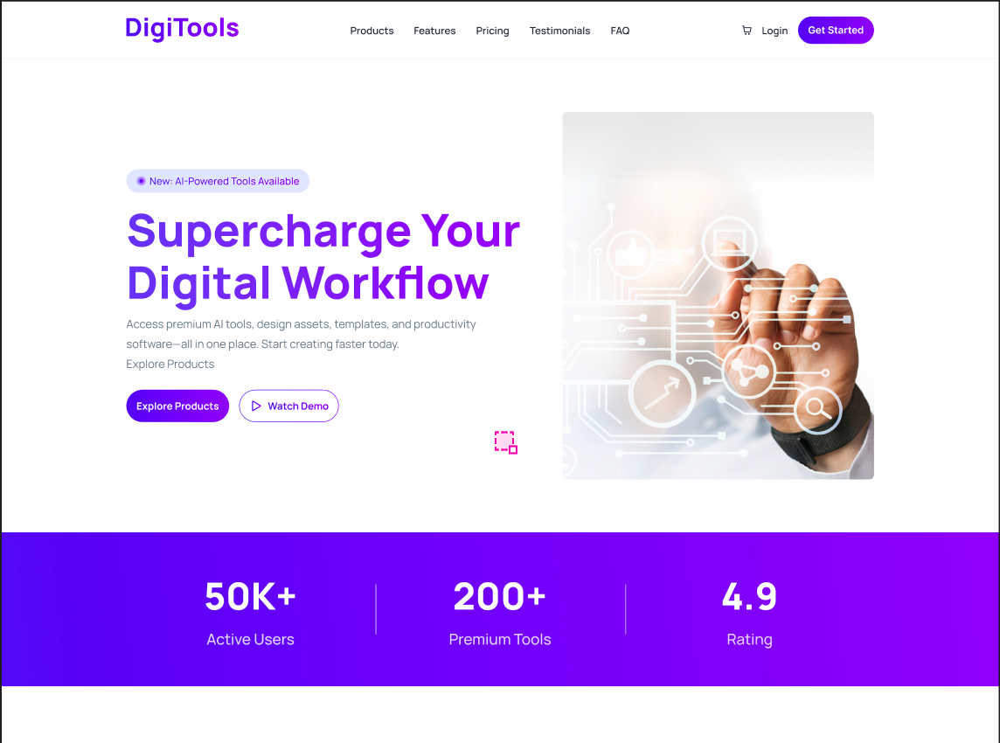
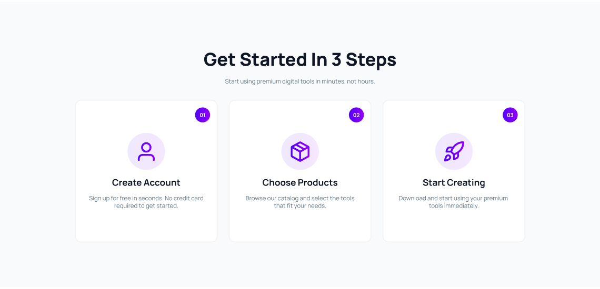
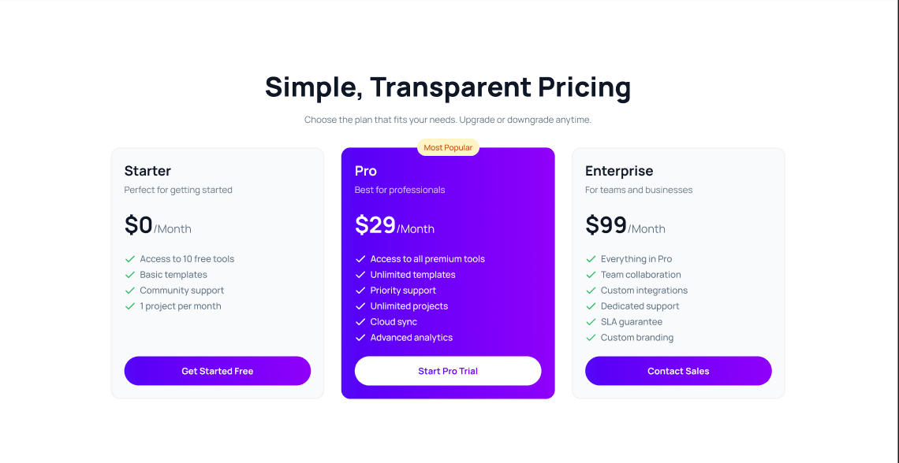

# 🚀 DigiTools - Supercharge Your Digital Workflow

<p align="center">
  
</p>


## 🌟 Overview

**DigiTools** is a powerful digital resource hub built with **React.js** and **Tailwind CSS**. It provides a suite of pro-level productivity tools, design assets, and automation kits designed to simplify the modern digital workflow. The project focuses on high-performance rendering, a clean aesthetic, and a seamless user experience.

---

## 📸 Screenshots & Previews

### 🛡️ Main Dashboard
The core interface features a high-impact hero section and real-time statistics showcasing user engagement (50K+ Active Users).


### 💎 Premium Tools Section
A curated collection of 6 essential tools (AI Writing, Design Templates, Automation, etc.) presented in a modern, card-based grid layout.


### ✅ Get Started In Three steps
A transparent three-tier pricing model combined with a streamlined 3-step onboarding process to maximize conversion.


---

### 💳 Pricing & Onboarding
A transparent three-tier pricing model combined with a streamlined 3-step onboarding process to maximize conversion.


---

## 🛠️ Tech Stack

- **Frontend Framework:** React.js (v18+)
- **Styling:** Tailwind CSS (Utility-first CSS)
- **Icons:** Lucide React / React Icons
- **Animations:** Framer Motion (For smooth UI transitions)
- **Build Tool:** Vite / Create React App
- **Deployment:** Vercel / Netlify

---

## ✨ Key Features

- **✅ Fully Responsive:** Optimized for a flawless experience across Mobile, Tablet, and Desktop devices.
- **✅ Interactive Metrics:** Dynamic counters for active users, premium tools, and ratings.
- **✅ Specialized Toolkits:** Categorized resources for AI, Design, Social Media, and Automation.
- **✅ Modern UI/UX:** A professional purple-themed interface following the latest design trends.
- **✅ Fast Performance:** Optimized asset loading and component-based architecture for rapid navigation.

---

## 📂 Project Structure

```text
/digitools
├── assets/
│   └── screenshots/     # Project mockup and feature screenshots
├── src/
│   ├── components/      # Reusable UI components (Navbar, Hero, Tools, Pricing)
│   ├── assets/          # Local images and static visual assets
│   ├── App.jsx          # Main application logic and routing
│   ├── index.css        # Tailwind directives and global styles
│   └── main.jsx         # Project entry point
├── public/              # Public static assets (Favicon, manifest)
├── tailwind.config.js   # Custom Tailwind theme configurations
├── package.json         # Dependencies and scripts
└── README.md            # Project documentation
```

## 🚀 How to Run Locally

Follow these steps to set up the project on your local machine.

### 📋 Prerequisites

Before you begin, ensure you have the following installed:
*   **Node.js:** [Download Node.js](https://nodejs.org/) (Recommended version: v16 or higher)
*   **npm:** This comes automatically with Node.js.
*   **Git:** To clone the repository.

---

### 🛠️ Step-by-Step Installation

**1. Clone the Repository:**
Open your terminal or command prompt and run:
```bash
git clone https://github.com/ab-siddik-ru-cse/digi-tools.git

```

**2. Navigate to the Project Directory:**

``` bash
cd digitools
```

**3. Install Dependencies:**

- This project relies on React and Tailwind CSS. Install the necessary packages by running:

``` bash
npm install
```
**4. Start the Development Server:**
- Launch the application locally with the following command:
``` bash
npm run dev
```